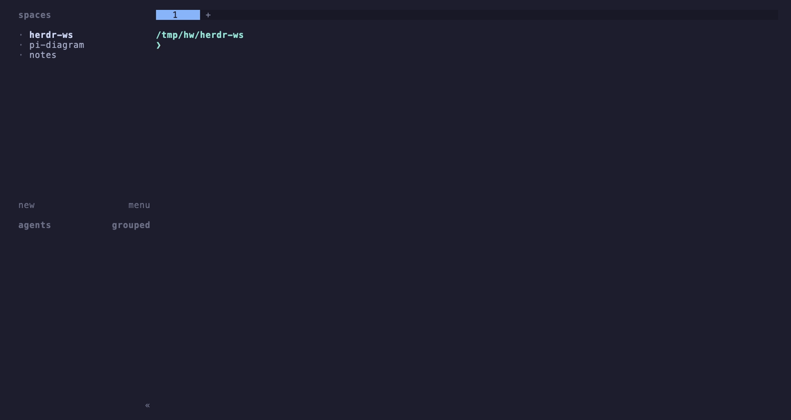

# Herdr Workspacer

[](https://github.com/mcuste/herdr-workspacer/actions/workflows/ci.yml)

An MRU fuzzy workspace picker for Herdr. It combines open workspaces with optional
[zoxide](https://github.com/ajeetdsouza/zoxide) directories in one popup, then focuses the selected
workspace or creates one at the selected directory.



## Why

Open workspaces and frequently used directories answer different parts of the same question:
where should the next terminal session run? Herdr Workspacer presents both sources in one list and
uses the last workspace selected or focused to keep active projects near the top.

Filtering never changes that order. A query only removes non-matching rows, so the same project
does not jump around while its name is typed.

## Requirements

- Herdr 0.8.0 or later on macOS or Linux
- zoxide, optionally, for directories that are not already open as Herdr workspaces

The plugin searches `PATH` and common macOS and Linux install locations. Set
`HERDR_WORKSPACER_ZOXIDE_PATH` to the executable for a custom installation.

The installed plugin does not need `fzf`, `jq`, Rust, or Cargo when a release binary is available.

## Install

```sh
herdr plugin install mcuste/herdr-workspacer
```

The installer downloads the release binary for the current operating system and architecture and
checks it against the release's `SHA256SUMS`. If no release binary is available, it builds from
source with Cargo. Installation fails rather than running a download that cannot be verified.

Choose any Herdr keybinding. For example, add this to `~/.config/herdr/config.toml`:

```toml
[[keys.command]]
key = "prefix+s"
type = "plugin_action"
command = "herdr-workspacer.open"
description = "open workspace picker"
```

Reload the configuration:

```sh
herdr server reload-config
```

Herdr lists active bindings with `prefix+?`. The action also works without a keybinding:

```sh
herdr plugin action invoke herdr-workspacer.open
```

## How candidates are ordered

The picker builds one list:

1. Open workspaces.
2. Remaining zoxide directories.

Paths are canonicalized before comparison. A zoxide entry that resolves to an open workspace appears
once as an active `[workspace]` row. Git metadata directories, missing zoxide directories, and
malformed records are skipped. Within each group, MRU paths come first. Remaining workspaces use
Herdr's order and remaining zoxide directories use descending zoxide score.

Selecting another directory first checks a fresh Herdr snapshot, then focuses a workspace that has
since opened there or creates a new focused workspace.

## Controls

| Key | Action |
| --- | --- |
| Text | Filter candidates |
| Backspace | Remove one query character |
| Up or `ctrl+p` | Move to the previous result |
| Down or `ctrl+n` | Move to the next result |
| PageUp or PageDown | Move one visible page |
| `ctrl+u` | Clear the query |
| Enter | Focus or create the selected workspace |
| Esc or `ctrl+c` | Close the picker |

An empty query uses the grouped source order. A query ranks every matching candidate by fuzzy
relevance and uses source order to break score ties.

## Failure behavior

The picker remains useful when optional data is unavailable:

- If zoxide is missing or its query fails, open workspaces remain available and the popup shows a
  warning.
- Open workspaces without a usable directory are skipped and counted in the warning.
- A missing or malformed MRU file starts with empty history. The malformed file is moved aside for
  inspection.
- A failed Herdr operation is shown in the popup and returned as a process error.

## Uninstall

```sh
herdr plugin uninstall herdr-workspacer
```

## Development

Requires Rust 1.85 or later, Cargo, Herdr 0.8.0 or later, and zoxide for full manual testing.

```sh
cargo build
mkdir -p bin
cp target/debug/herdr-workspacer bin/herdr-workspacer
herdr plugin link .
herdr plugin action invoke herdr-workspacer.open
```

Run the same verification gate as CI:

```sh
just verify
```

## Documentation

- [Contributing and commit conventions](CONTRIBUTING.md)
- [Development and release](docs/development.md)
- [Safety model](docs/safety.md)
- [Changelog](CHANGELOG.md)

## License

[MIT](LICENSE)
